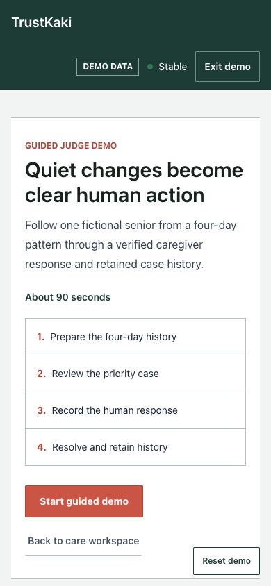
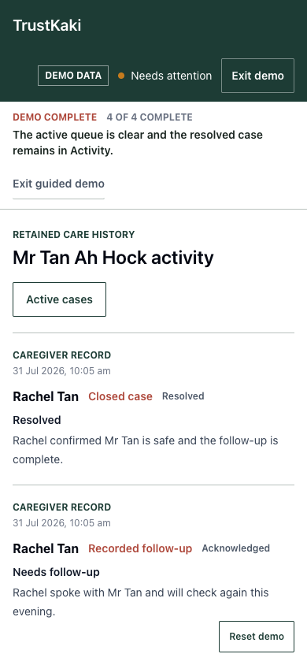

# TrustKaki

TrustKaki is an AI-assisted care coordination system that turns small changes
in a senior's everyday messages into clear, accountable human follow-up.

Built by **Team SandSeed** for the Tencent Cloud **AI CAN DO IT / Age Well
Social Good Challenge Singapore 2026**.

## Try It

- Public no-login demo: https://trustkaki.vercel.app
- Tencent EdgeOne deployment: https://trustkaki.edgeone.dev
- Rednote project post: https://xhslink.com/o/3OS90gWOeN7

All public demo data is fictional and isolated in the browser. It cannot access
care records, invoke the LLM, call messaging providers, run processors, or send
messages.

<p align="center">
  
  
</p>

## What It Does

- Consolidates changes across messages and time into one priority care case.
- Explains why a case was surfaced and how it differs from the senior's usual
  context.
- Recommends a bounded human follow-up while keeping care decisions with people.
- Records the caregiver response, resolution, and retained activity history.
- Routes validated inputs through Triage and conditionally selected specialist
  agents, with deterministic safety policy remaining authoritative.
- Supports organisation-scoped caregiver access and persistent operations in
  Supabase.

## Verified Evidence

- Telegram inbound processing and one outbound reply passed end to end.
- WhatsApp inbound processing, durable persistence, and send acceptance passed;
  Meta currently blocks final delivery until formal business verification.
- Vercel operates the primary live messaging path.
- Tencent EdgeOne runs the secondary full-stack product experience without
  messaging or scheduler credentials, avoiding duplicate sends.
- A bounded 18-case live evaluation measured 88.9% exact routing, 100% required
  specialist recall, 100% schema-valid outputs, and 0% fallback. Strict failures
  remain disclosed in the repository evidence.
- Mobile, keyboard, persistence, security-boundary, and production build checks
  are recorded under [`trustkaki-web/docs`](trustkaki-web/docs/).

## Architecture

```text
Telegram / WhatsApp / fictional public demo
  -> identity binding and validated input
  -> Triage plus conditionally selected specialists
  -> deterministic safety policy and Pattern Watch
  -> Supabase persistence
  -> caregiver queue, human response, resolution, and retained history
```

The application source is under [`trustkaki-web/`](trustkaki-web/). See its
[technical README](trustkaki-web/README.md) for environment variables, local
setup, database migrations, tests, security boundaries, and deployment details.

## Local Development

```bash
cd trustkaki-web
npm install
cp .env.example .env.local
npm run dev
```

Run the complete local quality gate with:

```bash
npm run validate
```

## Safety Boundaries

TrustKaki does not diagnose, prescribe, replace emergency services, or make
care decisions. It organises context for human review. Secrets remain
server-side, public demo state is fictional, and authenticated access is scoped
through Supabase Auth and row-level security.

## Project Status

TrustKaki is a hackathon-ready working product, not a clinically validated or
production-certified care service. WorkBuddy integration is not claimed because
the supplied access path was unavailable. The current limitations and dated
verification evidence are maintained in
[`PROJECT_CLOSEOUT.md`](trustkaki-web/docs/PROJECT_CLOSEOUT.md).

## Source Use

No open-source license is granted. The source is public for hackathon review and
portfolio transparency; all rights are reserved by Ng Min Xie.
